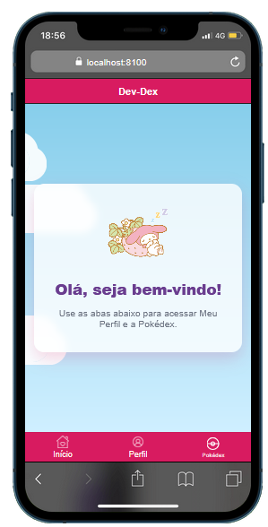
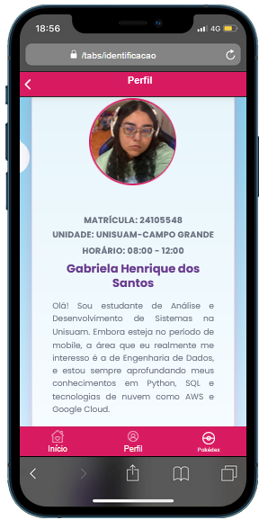
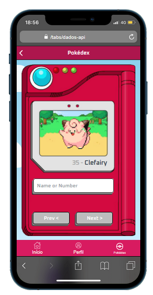
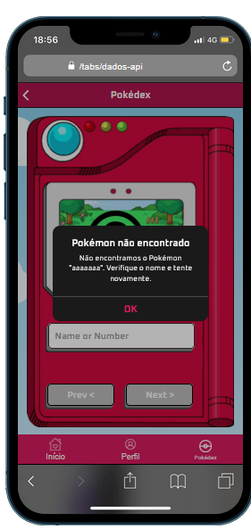

# Avaliação Formadora 2 – Módulo de Programação Móvel

Este repositório contém o código-fonte da aplicação desenvolvida para a Avaliação Formadora 2 da disciplina de Programação Móvel.
O projeto consiste em uma Pokédex Digital, criada com Ionic e Angular, que implementa uma interface com a PokeAPI.

## Objetivo do Projeto
O objetivo desta avaliação era desenvolver uma aplicação que consumisse uma API REST pública, demonstrando o domínio de:
- Consumo de APIs externas
- Navegação entre telas
- Manipulação de dados dinâmicos
- Feedback visual para o usuário
- Design responsivo e atraente

## Requisitos Cumpridos

### Estrutura do Projeto
- Iniciado utilizando o template tabs do Ionic
- Estrutura de arquivos e componentes seguindo boas práticas
- Implementação de serviços para consumo de API

### Tela 1 (Apresentação)
- Tela inicial com animação de nuvens
- Imagem de boas-vindas personalizada
- Texto introdutório para o usuário
- Navegação via tabs para outras seções




### Tela 2 (Identificação)
- Informações do desenvolvedor
- Dados de contato e perfil
- Layout clean e profissional



### Tela 3 (Pokédex)
- Interface inspirada na Pokédex clássica
- Busca de Pokémon por nome ou número
- Exibição de sprites animados (quando disponíveis)
- Botões de navegação prev/next
- Feedback visual para Pokémon não encontrados
- Alerta personalizado com mensagens contextuais
- Imagem de interrogação para buscas sem resultado

## Pokedex:



## Tela de erro (quando busca pokemon que não existe):




### Navegação
- Sistema de tabs do Ionic
- Botão de voltar nas telas internas
- Transições suaves entre páginas

### Design e Estilização
- Tema personalizado em tons de rosa/vermelho
- Animações de nuvens no background
- Interface responsiva e moderna
- Experiência de usuário polida

### Funcionalidades da API
- Integração com a PokeAPI
- Busca dinâmica de Pokémon
- Tratamento de erros e feedback
- Cache de dados para performance

## Tecnologias Utilizadas
- **Ionic Framework** – Framework principal do projeto
- **Angular** – Base de front-end para lógica e componentes
- **TypeScript** – Linguagem principal
- **SCSS** – Estilização avançada dos componentes
- **PokeAPI** – API REST para dados dos Pokémon

## ⚙️ Como Executar o Projeto

1. Clone o repositório:
```bash
git clone https://github.com/GabrielaHSantos/pokecalculator.git
```

2. Navegue até a pasta do projeto
```bash
cd dev-dex
```

3. Instale as dependências
```bash
npm install
```

4. Execute o servidor de desenvolvimento
```bash
ionic serve
```

## Melhorias Implementadas
- Feedback visual aprimorado com alertas personalizados
- Animações de transição entre estados
- Sistema de cache para sprites
- Tratamento de erros amigável
- Design responsivo e adaptativo